<div align="center">


<br>

[](#tentang)
[](#tim)
[](#level)
[](#dokumen)
[](#cara-main)


**Merencanakan versi digital UMKM Kedai Pujasera: menu, foto produk, harga, dan informasi kedai dalam satu website.**

</div>


<a id="tentang"></a>
## 🎮 Tentang Proyek

> 🎯 **MISI:** membuat versi digital Kedai Pujasera supaya pelanggan bisa melihat menu, foto, harga, dan info kedai kapan saja.
> 🕹️ **PEMAIN:** Kelompok 11, 4 orang.
> 🏁 **STAGE SAAT INI:** perencanaan. Tahap Inisiasi dan Perencanaan sudah selesai.

Kedai Pujasera adalah UMKM yang menjual berbagai makanan dan minuman. Karena pilihan menunya beragam, kedai ini membutuhkan cara yang baik untuk memperkenalkan menu dan informasi usahanya kepada pelanggan.

Proyek ini adalah tugas kelompok dengan studi kasus Kedai Pujasera. Kami berencana membuat **versi digital** kedai yang menampilkan menu, foto produk, harga, informasi kedai, dan informasi relevan lainnya. Repositori ini berisi seluruh tahapan proyek, dimulai dari dokumen perencanaan.

| Kondisi | Kebutuhan | Solusi yang diusulkan |
|---|---|---|
| Menu beragam, informasi belum terpusat | Pelanggan perlu tahu menu, harga, dan info kedai dengan mudah | Website informasi Kedai Pujasera |

<details>
<summary><b>🧺 Item di kedai (klik untuk membuka)</b></summary>

<br>

| Item | Kelompok |
|---|---|
| 🍹 Jus | Minuman |
| 🍵 Es teh | Minuman |
| 🧃 Minuman sachet | Minuman |
| 🍗 Nasi ayam caplak | Makanan |
| 🍛 Nasi goreng | Makanan |
| ➕ Menu lainnya | Menyusul |

</details>


<a id="tim"></a>
## 👥 Tim Kelompok 11

<div align="center">

</div>

| No | Nama | NIM | GitHub | Peran utama |
|:-:|---|---|---|---|
| 1 | Andi Saputra | `230504081` | [`Andi`](https://github.com/Andi) | Inisiasi, skenario pengujian, laporan proyek |
| 2 | Muhammad Hafiz Akbar | `230504077` | [`Apizzz2`](https://github.com/Apizzz2) | Perencanaan, repositori GitHub, dokumentasi repo |
| 3 | Arya Diansyah | `230504063` | [`Aryajisung11`](https://github.com/Aryajisung11) | Perancangan, tampilan halaman, pengujian |
| 4 | Kharisa Ariyana | `230504069` | [`Ica`](https://github.com/Ica) | Analisis kebutuhan, konten kedai, presentasi |

**Program Studi:** Teknik Informatika &nbsp;|&nbsp; **Fakultas:** Sains dan Teknologi &nbsp;|&nbsp; **Universitas:** Universitas Samudra
**Mata kuliah:** Manajemen Proyek Perangkat Lunak &nbsp;|&nbsp; **Dosen pengampu:** Cut Alna Fadhilla, S.Kom., M.Sc


<a id="level"></a>
## 🗺️ Peta Level Proyek

<div align="center">

</div>

Klik tiap level untuk melihat isinya.

<details>
<summary><b>⭐ LEVEL 1 — Inisiasi</b> &nbsp; ✅ selesai</summary>

<br>

- **1.1** Menentukan studi kasus dan ide proyek
- **1.2** Wawancara/observasi dengan pemilik kedai
- **1.3** Menyusun Project Charter
- **1.4** Menyusun Stakeholder Register

📄 [Latar Belakang dan Ide](docs/ide-proyek.md) · [Project Charter](docs/project-charter.md) · [Stakeholder Register](docs/stakeholder-register.md)
🧑‍🍳 Penanggung jawab: Andi Saputra

</details>

<details>
<summary><b>⭐ LEVEL 2 — Perencanaan</b> &nbsp; ✅ selesai</summary>

<br>

- **2.1** Menyusun WBS
- **2.2** Membagi tugas anggota kelompok
- **2.3** Menyusun jadwal kegiatan
- **2.4** Menyiapkan Git dan repositori GitHub

📄 [Work Breakdown Structure](docs/wbs.md) · [Git dan GitHub](docs/git-github.md)
🧑‍🍳 Penanggung jawab: Muhammad Hafiz Akbar

</details>

<details>
<summary><b>🔹 LEVEL 3 — Analisis Kebutuhan</b> &nbsp; ▶ berikutnya</summary>

<br>

- **3.1** Mengumpulkan data menu, harga, foto, dan informasi kedai
- **3.2** Menentukan kebutuhan pengguna
- **3.3** Menyusun kebutuhan fungsional dan nonfungsional

🧑‍🍳 Penanggung jawab: Kharisa Ariyana

</details>

<details>
<summary><b>🔒 LEVEL 4 — Perancangan</b></summary>

<br>

- **4.1** Merancang struktur informasi/halaman
- **4.2** Merancang tampilan (wireframe/mockup)
- **4.3** Menentukan teknologi yang digunakan

🧑‍🍳 Penanggung jawab: Arya Diansyah

</details>

<details>
<summary><b>🔒 LEVEL 5 — Pengembangan</b></summary>

<br>

- **5.1** Menyiapkan lingkungan pengembangan (Hafiz)
- **5.2** Membuat tampilan halaman (Arya)
- **5.3** Memasukkan menu, foto, harga, dan informasi kedai (Kharisa)
- **5.4** Mengelola versi kode melalui GitHub (Hafiz)

</details>

<details>
<summary><b>🔒 LEVEL 6 — Pengujian</b></summary>

<br>

- **6.1** Menyusun skenario pengujian (Andi)
- **6.2** Menguji tampilan dan fungsi (Arya)
- **6.3** Memperbaiki temuan (Kharisa)
- **6.4** Meminta masukan dari pemilik kedai (Andi)

</details>

<details>
<summary><b>🔒 LEVEL 7 — Dokumentasi</b></summary>

<br>

- **7.1** Menyusun laporan proyek (Andi)
- **7.2** Mendokumentasikan repositori dan cara penggunaan (Hafiz)
- **7.3** Menyiapkan presentasi proyek (Kharisa)

</details>

### ✅ Progres

- [x] Inisiasi: studi kasus, ide proyek, Project Charter, Stakeholder Register
- [x] Perencanaan: WBS, pembagian tugas, pemahaman Git dan GitHub
- [ ] Analisis kebutuhan
- [ ] Perancangan
- [ ] Pengembangan
- [ ] Pengujian
- [ ] Dokumentasi akhir


<a id="dokumen"></a>
## 🎒 Dokumen Proyek

| Tahap | Dokumen | Isi | Status |
|:-:|---|---|:-:|
| 1 | [Latar Belakang dan Ide Proyek](docs/ide-proyek.md) | Kondisi UMKM, hasil wawancara, masalah, ide, tujuan, manfaat | ✅ |
| 2 | [Project Charter](docs/project-charter.md) | Gambaran, ruang lingkup, batasan, risiko, tonggak proyek | ✅ |
| 3 | [Stakeholder Register](docs/stakeholder-register.md) | Pihak terlibat, peran, kepentingan, pengaruh, rencana komunikasi | ✅ |
| 4 | [Work Breakdown Structure](docs/wbs.md) | Pecahan pekerjaan dari inisiasi sampai dokumentasi | ✅ |
| 5 | [Git dan GitHub](docs/git-github.md) | Pemahaman dasar dan alur kerja tim | ✅ |

<details>
<summary><b>📁 Struktur repositori</b></summary>

```text
.
├── README.md
├── assets/
│   ├── banner.svg
│   ├── divider.svg
│   ├── footer.svg
│   ├── levels.svg
│   └── team.svg
└── docs/
    ├── ide-proyek.md
    ├── project-charter.md
    ├── stakeholder-register.md
    ├── wbs.md
    └── git-github.md
```

</details>


<a id="cara-main"></a>
## 🕹️ Cara Main (Kerja Tim di Repositori Ini)

<details>
<summary><b>🔧 Alur Git yang kami pakai</b></summary>

<br>

1. `git clone` repositori ke komputer masing-masing.
2. `git pull` sebelum mulai bekerja.
3. Buat branch baru untuk setiap bagian pekerjaan: `git checkout -b nama-branch`.
4. Simpan perubahan dengan `git add .` lalu `git commit -m "pesan yang jelas"`.
5. Kirim ke GitHub dengan `git push`, lalu buka *pull request*.
6. Anggota lain meninjau sebelum digabung ke branch `main`.

Penjelasan lengkap ada di [docs/git-github.md](docs/git-github.md).

</details>

<details>
<summary><b>📜 Contekan perintah Git</b></summary>

<br>

| Perintah | Fungsi |
|---|---|
| `git clone <alamat>` | Menyalin repositori dari GitHub |
| `git status` | Melihat berkas yang berubah |
| `git add .` | Menandai semua perubahan untuk disimpan |
| `git commit -m "pesan"` | Menyimpan perubahan |
| `git push` | Mengirim commit ke GitHub |
| `git pull` | Mengambil perubahan terbaru |
| `git checkout -b <branch>` | Membuat dan pindah ke branch baru |

</details>

<details>
<summary><b>❓ Tidak bisa upload?</b></summary>

<br>

- Pastikan undangan collaborator sudah diterima (cek email GitHub atau ikon lonceng).
- Buka **Settings → Collaborators** dan pastikan perannya **Write**.
- Pastikan login dengan akun yang diundang.

</details>

<br>

<div align="center">



**GAME ON!** Dibuat oleh **Kelompok 11** · Teknik Informatika · Universitas Samudra · 2026

</div>
