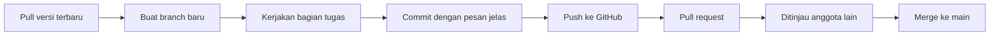

# 5. Pemahaman Git dan GitHub

[⬅️ WBS](wbs.md) &nbsp;|&nbsp; [Kembali ke README ➡️](../README.md)

---

## Apa itu Git dan GitHub?

**Git** adalah sistem kontrol versi. Fungsinya mencatat perubahan berkas dari waktu ke waktu sehingga kita bisa melihat riwayat, membandingkan versi, dan kembali ke versi sebelumnya bila terjadi kesalahan. Git berjalan di komputer masing-masing anggota.

**GitHub** adalah layanan berbasis web yang menyimpan repositori Git secara daring. Melalui GitHub, anggota bisa berbagi pekerjaan, melihat perubahan orang lain, dan berdiskusi tentang perubahan tersebut. Singkatnya: Git adalah alatnya, GitHub adalah tempat bersama untuk menyimpan dan mengelola hasil kerja.

## Mengapa Dibutuhkan di Proyek Ini?

- Seluruh pekerjaan tersimpan di satu tempat dan selalu ada versi terbaru.
- Setiap perubahan tercatat: siapa yang membuat dan kapan.
- Kesalahan bisa dibatalkan dengan kembali ke versi sebelumnya.
- Anggota dapat mengerjakan bagian berbeda secara bersamaan tanpa saling mengganggu.

## Istilah Dasar

| Istilah | Arti |
|---|---|
| Repository | Tempat penyimpanan seluruh berkas proyek beserta riwayatnya |
| Commit | Catatan satu kumpulan perubahan yang disimpan, disertai pesan penjelas |
| Branch | Cabang pekerjaan terpisah dari cabang utama |
| Merge | Menggabungkan perubahan dari satu branch ke branch lain |
| Clone | Menyalin repositori dari GitHub ke komputer sendiri |
| Push | Mengirim commit dari komputer ke GitHub |
| Pull | Mengambil perubahan terbaru dari GitHub ke komputer |
| Pull request | Permintaan menggabungkan perubahan sebuah branch, biasanya ditinjau anggota lain dulu |

## Perintah Dasar

```bash
git clone <alamat-repositori>      # menyalin repositori dari GitHub
git status                         # melihat berkas yang berubah
git add .                          # menandai semua perubahan untuk disimpan
git commit -m "pesan yang jelas"   # menyimpan perubahan
git push                           # mengirim commit ke GitHub
git pull                           # mengambil perubahan terbaru
git checkout -b nama-branch        # membuat dan pindah ke branch baru
```

## Alur Kerja Tim



1. Satu anggota membuat repositori dan menambahkan anggota lain sebagai kolaborator.
2. Setiap anggota melakukan *clone* ke komputernya.
3. Sebelum bekerja, jalankan *pull* agar memegang versi terbaru.
4. Kerjakan setiap bagian pada branch tersendiri, bukan langsung di `main`.
5. Setelah selesai, *commit* dengan pesan jelas lalu *push*.
6. Anggota lain meninjau lewat *pull request* sebelum digabung ke `main`.

## Aturan Kerja Kelompok 11

- Branch `main` hanya berisi hasil kerja yang sudah ditinjau.
- Pesan commit singkat tetapi jelas, misalnya `menambah daftar menu minuman`.
- Commit sering dan dalam ukuran kecil agar mudah dilacak.
- Bila terjadi konflik penggabungan, diselesaikan bersama anggota terkait.

## Referensi

- Chacon, S., & Straub, B. (2014). *Pro Git* (2nd ed.). Apress.
