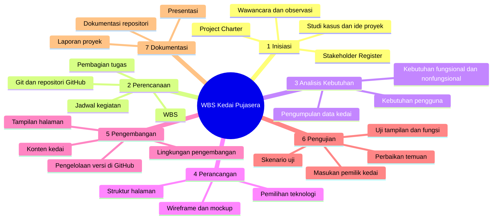

# 4. Work Breakdown Structure (WBS)

[⬅️ Stakeholder Register](stakeholder-register.md) &nbsp;|&nbsp; [Berikutnya: Git dan GitHub ➡️](git-github.md)

---

WBS memecah proyek menjadi tahapan dan paket kerja yang lebih kecil agar mudah dibagi dan dipantau. **Tingkat 1** adalah tahapan utama, **tingkat 2** adalah paket kerja di dalamnya.

## Diagram

## Tabel WBS

| Kode | Tahapan / Paket Kerja | Keluaran |
|:-:|---|---|
| **1** | **INISIASI** | Dasar proyek |
| 1.1 | Menentukan studi kasus dan ide proyek | Ide proyek terpilih |
| 1.2 | Wawancara/observasi dengan pemilik kedai | Catatan hasil wawancara |
| 1.3 | Menyusun Project Charter | Dokumen Project Charter |
| 1.4 | Menyusun Stakeholder Register | Dokumen Stakeholder Register |
| **2** | **PERENCANAAN** | Rencana kerja |
| 2.1 | Menyusun WBS | Dokumen WBS |
| 2.2 | Membagi tugas anggota kelompok | Pembagian tugas tim |
| 2.3 | Menyusun jadwal kegiatan | Jadwal proyek |
| 2.4 | Menyiapkan Git dan repositori GitHub | Repositori proyek siap dipakai |
| **3** | **ANALISIS KEBUTUHAN** | Kebutuhan yang jelas |
| 3.1 | Mengumpulkan data menu, harga, foto, dan informasi kedai | Data kedai terkumpul |
| 3.2 | Menentukan kebutuhan pengguna | Daftar kebutuhan pengguna |
| 3.3 | Menyusun kebutuhan fungsional dan nonfungsional | Dokumen kebutuhan sistem |
| **4** | **PERANCANGAN** | Rancangan solusi |
| 4.1 | Merancang struktur informasi/halaman | Struktur halaman |
| 4.2 | Merancang tampilan (wireframe/mockup) | Rancangan tampilan |
| 4.3 | Menentukan teknologi yang digunakan | Daftar teknologi |
| **5** | **PENGEMBANGAN** | Versi digital |
| 5.1 | Menyiapkan lingkungan pengembangan | Proyek dasar siap dikerjakan |
| 5.2 | Membuat tampilan halaman | Halaman-halaman website |
| 5.3 | Memasukkan menu, foto, harga, dan informasi kedai | Konten terpasang |
| 5.4 | Mengelola versi kode melalui GitHub | Riwayat commit dan repositori |
| **6** | **PENGUJIAN** | Hasil sesuai kebutuhan |
| 6.1 | Menyusun skenario pengujian | Skenario uji |
| 6.2 | Menguji tampilan dan fungsi | Hasil pengujian |
| 6.3 | Memperbaiki temuan | Versi hasil perbaikan |
| 6.4 | Meminta masukan dari pemilik kedai | Catatan masukan pemilik |
| **7** | **DOKUMENTASI** | Rangkuman hasil |
| 7.1 | Menyusun laporan proyek | Laporan akhir |
| 7.2 | Mendokumentasikan repositori dan cara penggunaan | README dan panduan |
| 7.3 | Menyiapkan presentasi proyek | Bahan presentasi |

## Uraian Tahapan

1. **Inisiasi** — meletakkan dasar proyek: menentukan studi kasus dan ide, mewawancarai pemilik kedai, lalu menyusun Project Charter dan Stakeholder Register.
2. **Perencanaan** — mengatur pekerjaan: menyusun WBS, membagi tugas, membuat jadwal, dan menyiapkan repositori GitHub.
3. **Analisis kebutuhan** — mengumpulkan data kedai dan memastikan apa yang dibutuhkan pengguna, baik fungsional maupun nonfungsional.
4. **Perancangan** — merancang struktur halaman dan tampilan serta memilih teknologi. Rancangan dikonfirmasi pemilik kedai sebelum pengembangan.
5. **Pengembangan** — mewujudkan rancangan menjadi website dan mengelola perubahan kode lewat GitHub.
6. **Pengujian** — menguji tampilan dan fungsi, memperbaiki temuan, dan meminta masukan pemilik kedai serta pelanggan.
7. **Dokumentasi** — merangkum hasil dalam laporan, dokumentasi repositori, dan bahan presentasi.

## Keterkaitan Antartahap

| Tahap | Bergantung pada | Alasan |
|---|---|---|
| Perencanaan | Inisiasi | Rencana kerja disusun setelah ruang lingkup jelas |
| Analisis kebutuhan | Perencanaan | Pengumpulan data memerlukan pembagian tugas dan jadwal |
| Perancangan | Analisis kebutuhan | Rancangan berdasar kebutuhan dan data kedai |
| Pengembangan | Perancangan | Website dibuat mengikuti rancangan yang disetujui |
| Pengujian | Pengembangan | Yang diuji adalah website yang sudah jadi |
| Dokumentasi | Pengujian | Laporan akhir memuat hasil pengujian; sebagian dokumentasi berjalan paralel sejak awal |

## Pembagian Tugas Tim

| Anggota | Tanggung jawab utama | Kode WBS |
|---|---|:-:|
| Andi Saputra | Inisiasi; skenario pengujian; masukan pemilik kedai; laporan proyek | 1, 6.1, 6.4, 7.1 |
| Muhammad Hafiz Akbar | Perencanaan, repositori GitHub; lingkungan pengembangan; pengelolaan versi kode; dokumentasi repositori | 2, 5.1, 5.4, 7.2 |
| Arya Diansyah | Perancangan; tampilan halaman; pengujian tampilan dan fungsi | 4, 5.2, 6.2 |
| Kharisa Ariyana | Analisis kebutuhan; konten kedai; perbaikan temuan; presentasi | 3, 5.3, 6.3, 7.3 |

> Pembagian ini usulan awal dan dapat disesuaikan. Anggota saling membantu pada tahap yang butuh kerja bersama, seperti pengumpulan data dan pengujian.
