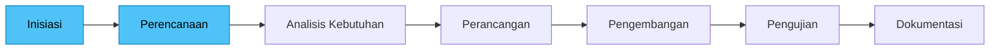

<div align="center">



# 🍽️ Kedai Pujasera Digital

**Merencanakan versi digital UMKM Kedai Pujasera: menu, foto produk, harga, dan informasi kedai dalam satu website.**


</div>

---

## 📌 Tentang Proyek

Kedai Pujasera adalah UMKM yang menjual berbagai makanan dan minuman, seperti **jus, es teh, minuman sachet, nasi ayam caplak, nasi goreng**, dan menu lainnya. Karena pilihan menunya beragam, kedai ini membutuhkan cara yang baik untuk memperkenalkan menu dan informasi usahanya kepada pelanggan.

Proyek ini adalah tugas kelompok dengan studi kasus Kedai Pujasera. Kami berencana membuat **versi digital** kedai yang menampilkan menu, foto produk, harga, informasi kedai, dan informasi relevan lainnya. Repositori ini berisi seluruh tahapan proyek, dimulai dari dokumen perencanaan.

| Kondisi | Kebutuhan | Solusi yang diusulkan |
|---|---|---|
| Menu beragam, informasi belum terpusat | Pelanggan perlu tahu menu, harga, dan info kedai dengan mudah | Website informasi Kedai Pujasera |

---

## 👥 Tim Kelompok 11

| No | Nama | NIM | GitHub | Peran utama |
|:-:|---|---|---|---|
| 1 | Andi Saputra | `[ISI NIM]` | `[ISI username]` | Inisiasi, skenario pengujian, laporan proyek |
| 2 | Muhammad Hafiz Akbar | `[ISI NIM]` | `[ISI username]` | Perencanaan, repositori GitHub, dokumentasi repo |
| 3 | Arya Diansyah | `[ISI NIM]` | `[ISI username]` | Perancangan, tampilan halaman, pengujian |
| 4 | Kharisa Ariyana | `[ISI NIM]` | `[ISI username]` | Analisis kebutuhan, konten kedai, presentasi |

**Program Studi:** Teknik Informatika &nbsp;|&nbsp; **Fakultas:** Sains dan Teknologi &nbsp;|&nbsp; **Universitas:** Universitas Samudra
**Mata kuliah:** `[ISI nama mata kuliah]` &nbsp;|&nbsp; **Dosen pengampu:** `[ISI nama dosen]`

---

## 🗂️ Dokumen Proyek

| Tahap | Dokumen | Isi | Status |
|:-:|---|---|:-:|
| 1 | [Latar Belakang dan Ide Proyek](docs/ide-proyek.md) | Kondisi UMKM, hasil wawancara, masalah, ide, tujuan, manfaat | ✅ |
| 2 | [Project Charter](docs/project-charter.md) | Gambaran, ruang lingkup, batasan, risiko, tonggak proyek | ✅ |
| 3 | [Stakeholder Register](docs/stakeholder-register.md) | Pihak terlibat, peran, kepentingan, pengaruh, rencana komunikasi | ✅ |
| 4 | [Work Breakdown Structure](docs/wbs.md) | Pecahan pekerjaan dari inisiasi sampai dokumentasi | ✅ |
| 5 | [Git dan GitHub](docs/git-github.md) | Pemahaman dasar dan alur kerja tim | ✅ |

---

## 🧭 Alur Tahapan Proyek



Warna biru muda menandai tahap yang sedang dikerjakan saat ini.

### ✅ Progres

- [x] Inisiasi: studi kasus, ide proyek, Project Charter, Stakeholder Register
- [x] Perencanaan: WBS, pembagian tugas, pemahaman Git dan GitHub
- [ ] Analisis kebutuhan
- [ ] Perancangan
- [ ] Pengembangan
- [ ] Pengujian
- [ ] Dokumentasi akhir

---

## 📁 Struktur Repositori

```text
.
├── README.md
├── assets/
│   ├── banner.svg
│   └── footer.svg
└── docs/
    ├── ide-proyek.md
    ├── project-charter.md
    ├── stakeholder-register.md
    ├── wbs.md
    └── git-github.md
```

---

## 🔧 Cara Kerja Tim di Repositori Ini

<details>
<summary><b>Klik untuk melihat alur Git yang kami pakai</b></summary>

1. `git clone` repositori ke komputer masing-masing.
2. `git pull` sebelum mulai bekerja.
3. Buat branch baru untuk setiap bagian pekerjaan: `git checkout -b nama-branch`.
4. Simpan perubahan dengan `git add .` lalu `git commit -m "pesan yang jelas"`.
5. Kirim ke GitHub dengan `git push`, lalu buka *pull request*.
6. Anggota lain meninjau sebelum digabung ke branch `main`.

Penjelasan lengkap ada di [docs/git-github.md](docs/git-github.md).

</details>

---

<div align="center">


Dibuat dengan ☕ oleh **Kelompok 11** · Teknik Informatika · Universitas Samudra · 2026

</div>
